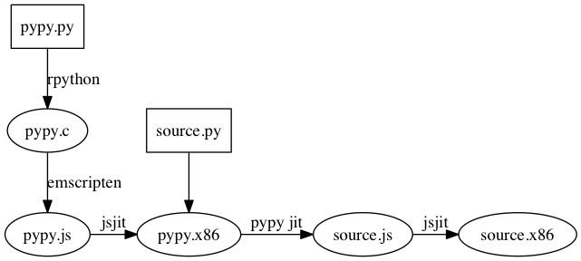

# pypyjs

## me

[github.com/albertjan](https://github.com/albertjan)

[albertjan@curit.com](mailto:albertjan@curit.com)

[@ajpnijburg](https://twitter.com/ajpnijburg)

__Not__ a python programmer!

## why?

 - because you can
 - python programmers appear to __hate__ javascript
 - wanted to learn about compilers
 - because trinket.io asked me to

## tinket.io


## it's a bug

 > For Mozilla, anything that the Web can’t do, or anything that the Web is not faster and better at than native technologies, is a bug.

 Ryan Kelly started patching it.

## history

 - sending python to the server from the browser.
 - skulpt.org
 - future

## usage

 - teaching [trinket.io](http://trinket.io)
 - people get better, giving them a working example says 1000pictures

## working example (skulpt)

 - list comprehension `[2 * x for x in range(101) if x ** 2 > 3]`

 - `import compiler`

## pypyjs

```py
import compiler
from compiler.visitor import ExampleASTVisitor

class SimpleVisitor(object):
    def visitFunction(self, parsedFunc):
        print "Function %(name)s at %(lineno)s takes %(argnames)s with code %(code)s" % parsedFunc.__dict__

code = '''
class Test:
    def __init__(self):
        print "test"
'''

ast = compiler.parse(code)
compiler.walk(ast, SimpleVisitor(), ExampleASTVisitor(), verbose=True)
```

#wtf!

</img>

This can't be fast!

- cpython pystones 50000
- skulpt pystones 2500
- pypyjs pystones 3900 1st run
- pypyjs pystones 90000 2nd run (jit!)

#what do I do

- make synchronous functions available from python `time.sleep()`
- make async javascript functions appear synchronous in python (turtle)
- make the build process a litle easier.
